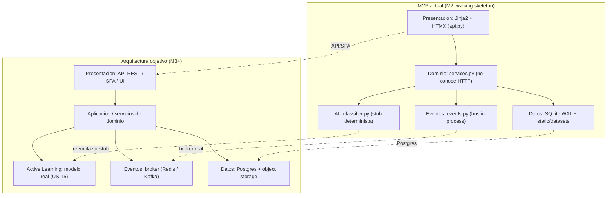
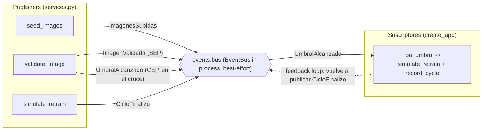
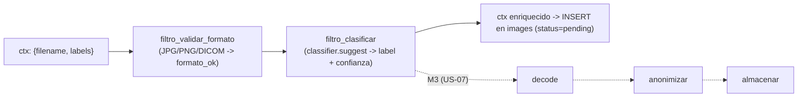
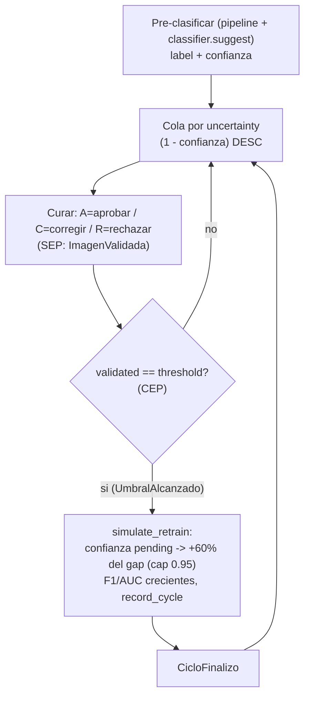
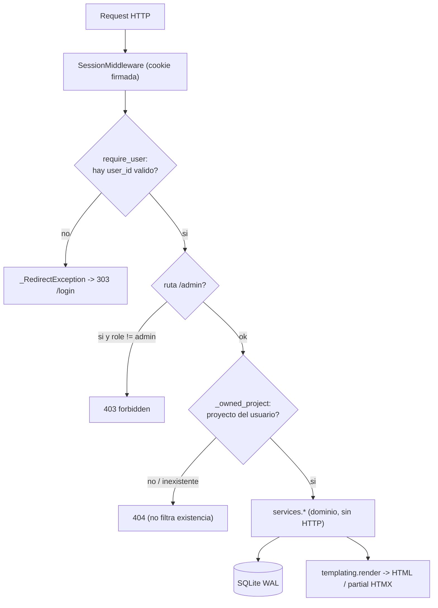

# Preparacion de defensa: Q&A y diagramas

Documento de apoyo para la defensa oral del MVP de PACUSAM (Grupo 9, LCD-UNSAM, 1C 2026).
Dos partes:

1. **Q&A**: 18 preguntas anticipadas del docente con respuesta concreta, ancladas a
   `docs/trazabilidad.md`, al registro de riesgos y a las actividades del curso.
2. **Diagramas** en Mermaid y ASCII (ambos formatos, para slides y para pizarra), cada uno con
   una linea de explicacion.

Convencion de actividades: A.4 (estimacion de esfuerzo / costo y equipo), A.7 (estilos
arquitectonicos), A.8 (vistas / modelo C4), A.9 (criterios de aceptacion / BDD), A.10 (walking
skeleton / WBS), A.11 (gestion de riesgos). Riesgos: R03 (motor de Active Learning demasiado
complejo para el alcance), R04 (almacenamiento / datos sensibles).

---

## Parte 1: preguntas anticipadas

### Q1. Por que el motor de Active Learning esta mockeado y no es un modelo real?

Es una **mitigacion consciente de R03**: si el motor de AL resulta demasiado complejo para el
alcance, se excluye del MVP. La arquitectura objetivo (`docs/arquitectura.md`) lo declara como
componente `active_learning`, "riesgo critico R03, llega en M3, no en el MVP". El milestone M2 es
un **walking skeleton** (A.10): la rebanada end-to-end de ingesta + curado manual sobre un
**dataset semilla mockeado**. Por eso `classifier.py` es un stub determinista por hash, mientras
que la **interfaz** (sugerencia + confianza, cola, ciclos, metricas) es real y testeada. El
modelo real (US-13/15) reemplaza solo `classifier.py` sin tocar `services` ni `api`.

### Q2. Que esta mockeado exactamente y que es real? No quiero "humo".

Mock honesto, con la frontera explicita:

| Parte | Estado | Evidencia en codigo |
|---|---|---|
| Pre-clasificacion (label + confianza) | **mock** determinista por hash | `classifier.suggest` (sha256 del filename, confianza en `[0.50, 0.99]`) |
| Uncertainty sampling (orden de la cola) | **REAL** | `services._order_rows`: `sorted(key=-(1 - confidence), id)` |
| Concordancia curador<->modelo | **REAL**, calculada sobre la DB | `services.concordance`: `agreed / total_validated` |
| Matriz de confusion, precision/recall | **REAL**, sobre validadas | `services.confusion_matrix`, `services.quality_metrics` |
| Re-entrenamiento (boost de confianza) | **simulado** | `services.simulate_retrain`: cierra el 60% del gap, cap 0.95 |
| F1 / AUC por ciclo | **mock** determinista creciente | `simulate_retrain`: `f1 = min(0.82 + 0.04*n, 0.97)` |

La linea es clara: **lo que decide la experiencia del curador (la cola por incertidumbre) es
real**; lo que requeriria entrenar un modelo de verdad esta simulado de forma determinista para
tests reproducibles.

### Q3. Que pasa si me piden ver el modelo real en la defensa?

Se muestra `classifier.py` y se explica que es el **unico** punto de sustitucion: la firma
`suggest(filename, labels) -> (label, confidence)` es el contrato. El modelo real (un clasificador
de imagenes medicas, US-15) cumple esa misma firma y entra por el `filtro_clasificar` del pipeline
(`pipeline.py`) sin reescribir el flujo. La defensa es por **alcance y trazabilidad** (R03 + M2),
no por implementacion: el MVP demuestra la arquitectura que aloja al modelo, no el modelo.

### Q4. Por que un monolito y no microservicios?

Porque M2 es un **walking skeleton** (A.10): el objetivo es una rebanada end-to-end (US-10) que
funcione punta a punta, no una topologia distribuida. La justificacion de costo es A.4: equipo de
2 part-time y presupuesto acotado, microservicios agregarian infraestructura (service mesh,
deploy, observabilidad) sin valor para validar la hipotesis. **Clave**: el monolito ya esta
**Layered** (`api` -> `services` -> `db`) y el dominio **no conoce HTTP**, asi que cada servicio
es sustituible/extraible sin reescritura. El monolito es una decision de *deployment*, no de
*acoplamiento*.

### Q5. Donde estan los estilos arquitectonicos del white paper (A.7)? No quiero diagramas, quiero codigo.

Los cuatro estilos estan materializados, no solo dibujados:

- **Layered**: separacion fisica `api.py` (presentacion) -> `services.py` (dominio) -> `db.py`
  (datos). `services` no importa FastAPI; recibe `conn` por parametro.
- **Pub-Sub**: `events.py`, bus sincrono en memoria (`EventBus`), 4 eventos canonicos
  (`ImagenesSubidas`, `ImagenValidada`, `UmbralAlcanzado`, `CicloFinalizo`). Publishers en
  `services.py`, suscriptores registrados en `create_app`.
- **Event Processing (SEP/OEP/CEP)**: ver Q11.
- **Pipes & Filters**: `pipeline.py`, ingesta como filtros puros encadenados
  `[filtro_validar_formato, filtro_clasificar]`.

### Q6. El Pub-Sub es de verdad o es una llamada de funcion disfrazada?

Es un bus real con desacople temporal y espacial dentro del proceso. `services.py` hace
`events.bus.publish(EVENTO, payload)` sin saber **quien** escucha ni **cuantos**. Los suscriptores
se registran en `create_app` con `events.bus.subscribe(...)`. La entrega es **best-effort**: un
handler que lanza excepcion no corta a los demas ni propaga al publisher (`EventBus.publish` envuelve
cada handler en `try/except`). No es Celery/Redis a proposito: el white paper pedia el **estilo**,
no la infraestructura, y agregar un broker violaria A.4 (presupuesto). El bus es el "gancho" donde
M3 puede enchufar un broker real sin tocar los publishers.

### Q7. Como se calcula la concordancia (US-19)?

Es la tasa de acuerdo curador<->modelo sobre las **validadas** (excluye pendientes y rechazadas).
En `services.concordance`:

```
agreed = cantidad de validadas con final_label == suggested_label
rate   = agreed / total_validated   (0 si no hay validadas)
```

Sobre el dataset semilla da ~85.7%: el seed corrige a proposito ~1 de cada 7 validadas
(`seed.py`) para que la concordancia sea **creible** y no 100%. Es una metrica honesta: mide
cuanto coincidio el humano con la sugerencia del stub, calculada sobre filas reales de la DB.

### Q8. Que es uncertainty sampling y por que la cola se ordena asi?

Uncertainty sampling es la estrategia de Active Learning que prioriza las muestras donde el modelo
esta **mas inseguro**, porque etiquetar esas es lo que mas informacion aporta para mejorar. La
incertidumbre se define como `1 - confianza`. En `services._order_rows` (estrategia `uncertainty`,
la default):

```
sorted(rows, key = (-(1.0 - confidence), id_asc))
```

La mas dudosa (mayor `1 - confianza`) primero; empate por `id` ascendente para que el orden sea
estable y determinista. Esto es **AL real**: aunque el score venga del stub, la **politica de
seleccion** es la correcta y es lo que el curador percibe en el filmstrip y en la proxima carta.
Las otras estrategias (`random` con seed determinista, `sequential` por id) existen para comparar
contra el baseline.

### Q9. Por que SQLite y no Postgres / un servidor de base de datos?

Dos razones ancladas:

- **R04 (almacenamiento / datos sensibles)**: SQLite a archivo = almacenamiento **local**, sin
  exponer un puerto de DB ni mover datos a un servicio externo. Los datasets sembrados son
  publicos y **sin PII**, lo que mitiga el riesgo de datos sensibles para el MVP.
- **A.4 (presupuesto / equipo)**: cero infraestructura, parte de la stdlib de Python, sin DBA ni
  servidor que administrar para 2 personas part-time.

No es ingenuo: `db.connect` usa `PRAGMA journal_mode=WAL` + `busy_timeout=3000` (D18) para
tolerar concurrencia sin corromper datos (atributo Fiabilidad de ISO/IEC 25010). Postgres es la
opcion natural de la arquitectura objetivo (capa de datos), y la migracion no toca el dominio
porque `services` recibe la conexion por parametro.

### Q10. Como escala esto a la arquitectura objetivo de 5 capas?

El MVP ya tiene la separacion Layered (`api`/`services`/`db`); la arquitectura objetivo expande
cada capa sin reescribir el dominio:

- **Presentacion**: hoy Jinja2+HTMX server-side; manana puede convivir con una API REST/SPA
  detras del mismo `services`.
- **Aplicacion/servicios**: `services.py` ya es el dominio puro; se parte en modulos
  (curado / analytics / al) si crece.
- **Active Learning**: el stub `classifier.py` se reemplaza por el modelo real (US-15) detras de
  la misma firma.
- **Eventos**: el bus in-process de `events.py` se reemplaza por un broker (Redis/Kafka) sin
  tocar publishers.
- **Datos**: SQLite -> Postgres + object storage para imagenes; `db.connect` es el unico punto.

Ver el diagrama "Arquitectura objetivo (5 capas) vs MVP actual" abajo.

### Q11. Que son SEP, OEP y CEP y donde estan?

Los tres niveles de Event Processing del white paper (A.7), todos materializados:

- **SEP (Single Event Processing)**: cada accion de curado emite **un** evento de dominio
  uno-a-uno. Cada `POST /validate|reject` publica `ImagenValidada` (`services.validate_image`).
- **OEP (Online Event Processing)**: el score se actualiza al instante y la **cola se reordena**
  por incertidumbre tras cada accion (`queue_next` se vuelve a llamar y re-ordena). Procesamiento
  en linea, en tiempo real.
- **CEP (Complex Event Processing)**: `UmbralAlcanzado` es un evento **derivado** de N
  `ImagenValidada` acumuladas. Se publica solo en el **cruce exacto** (`validated == threshold`)
  y dispara el re-entrenamiento automatico (`_on_umbral` en `create_app`). Esto es el **feedback
  loop** que cierra el ciclo de Pipes & Filters via Pub-Sub.

### Q12. Mostrame el feedback loop. Como se dispara el re-entrenamiento solo?

Cadena completa, sin intervencion manual:

1. El curador valida una imagen -> `services.validate_image` publica `ImagenValidada` (SEP).
2. La misma funcion consulta `threshold_status`; si `validated == threshold` publica
   `UmbralAlcanzado` (CEP), **una sola vez** en el cruce.
3. El suscriptor `_on_umbral` (registrado en `create_app`) corre `simulate_retrain` sobre las
   pendientes (acerca su confianza a 1.0, cap 0.95), registra el ciclo (F1/AUC crecientes) y
   publica `CicloFinalizo`.
4. Como las confianzas cambiaron, la cola de uncertainty sampling se re-ordena (OEP).

El umbral del dataset semilla es `retrain_threshold = 20` (`seed.py`). El suscriptor que **muta
estado** se registra solo en `create_app`, nunca a nivel de import, para que los tests unitarios
de dominio no auto-reentrenen.

### Q13. Por que Pipes & Filters en la ingesta si todavia no hay ingesta real?

Porque el estilo es **estructural**, no cosmetico: `pipeline.py` define filtros puros
`f(ctx) -> ctx` y un runner que los aplica en orden. Hoy la ingesta corre
`[filtro_validar_formato, filtro_clasificar]` sobre cada imagen sembrada (lo usa `seed_images`).
Cuando llegue la ingesta real (US-07/M3) se **agregan** filtros (decode, anonimizar, almacenar)
sin reescribir el flujo: solo se extiende la lista `INGESTA`. El diseno deja el "gancho" hecho. El
`filtro_validar_formato` ya conoce JPG/PNG/DICOM (`_FORMATOS_OK`).

### Q14. Por que server-side rendering (Jinja2+HTMX) y no React/una SPA?

A.4 (costo y tamano de equipo): una SPA separada agrega build, npm, bundling y un frontend que
mantener, mas story points para 2 part-time. Con Jinja2 + HTMX + Alpine se logra la interactividad
de los wow-moments (curado por teclado con auto-avance, filmstrip que se reordena, analytics) sin
toolchain de JS. El vendor (HTMX/Alpine/Tailwind/Lucide) esta **local** en `static/vendor`, sin CDN
ni build. La capa de presentacion sigue siendo sustituible porque no contiene logica de dominio.

### Q15. Como aseguran la calidad? Es solo "anda en mi maquina"?

Plan de Calidad (A.9) anclado a **ISO/IEC 25010**:

- **248 tests verdes**: unitarios de dominio/auth + endpoints + integracion + BDD en Gherkin
  (`tests/features/curado.feature` con pytest-bdd: la cola por incertidumbre, validar actualiza el
  progreso, rechazar excluye de la cola).
- **Funcionalidad**: criterios de aceptacion ejecutables (BDD).
- **Fiabilidad**: WAL + `busy_timeout` ante concurrencia; endpoint `GET /health`.
- **Seguridad**: `pbkdf2_sha256` (200.000 iteraciones, stdlib), comparacion en tiempo constante
  (`hmac.compare_digest`), cookies de sesion firmadas, password minimo server-side, `_owned_project`
  evita IDOR (404 a recurso ajeno), datasets sin PII (R04).
- **Eficiencia**: test de performance (`/login` y `/health` responden bajo 3s).
- **Mantenibilidad**: cobertura de docstrings >= 80% verificada por test; estilos aislados.

### Q16. Por que el password se valida en el servidor si ya hay minlength en el HTML?

Porque el `minlength` del cliente es solo UX y se puede saltear (request directo, devtools). La
validacion **autoritativa** es server-side (atributo Seguridad de ISO/IEC 25010): `auth.create_user`
lanza `DomainError("password_too_short")` si la contrasena tiene menos de 6 caracteres, y `api.py`
lo mapea a HTTP 422. La regla de negocio vive en el dominio, no en la vista.

### Q17. Como evitan que un curador vea proyectos de otro usuario (IDOR)?

Con autorizacion por dueño (D05). `_owned_project` (en `api.py`) verifica `owner_id == user.id` y,
si el proyecto no existe **o es de otro usuario**, responde **404, no 403**, para no filtrar la
existencia del recurso. La sesion se valida en cada request via `require_user` (Depends), que
limpia la sesion si el `user_id` apunta a un usuario inexistente. El rol admin se exige aparte con
`require_admin` (403 si no es admin), que protege `/admin` y el log de actividad.

### Q18. Que quedo fuera del MVP y por que no es un olvido?

Roadmap **decidido y documentado** en `docs/trazabilidad.md` (no olvidado), acotado por M2:

- US-07: ingesta real (upload + decode + DICOM). El pipeline ya deja el gancho.
- US-13/15: motor de AL real (mitigacion de R03).
- US-18: busqueda en galeria dedicada.
- US-24: filtros de export. US-25: reporte PDF del proyecto.
- Cambio de rol en vivo.
- Deploy en Render: `render.yaml` versionado, deploy manual del dashboard.

Cada diferido tiene su clausula de white paper, actividad y (donde aplica) riesgo en la tabla de
trazabilidad. La regla es: lo materializado se defiende por **codigo + tests**; lo diferido se
defiende por **alcance + trazabilidad**.

---

## Parte 2: diagramas

Cada diagrama esta en Mermaid (para render en slides) y en ASCII (para pizarra / fallback).

### Diagrama 1: arquitectura objetivo (5 capas) vs MVP actual

**Explicacion**: el MVP ya tiene la separacion Layered del objetivo; cada capa objetivo expande la
del MVP sin reescribir el dominio (`classifier.py`, el bus y `db.connect` son los unicos puntos de
sustitucion).



```
ARQUITECTURA OBJETIVO (M3+)            MVP ACTUAL (M2, walking skeleton)
+-------------------------------+      +------------------------------------+
| 1. Presentacion: REST/SPA/UI  | <... | 1. Presentacion: Jinja2+HTMX       |
+-------------------------------+ API  |    (api.py)                        |
            |                          +------------------------------------+
            v                                       |
+-------------------------------+                   v
| 2. Aplicacion / dominio       | ==== | 2. Dominio: services.py            |
+-------------------------------+ ==   |    (no conoce HTTP)                |
   |          |          |       |     +------------------------------------+
   v          v          v             |       |          |          |
+--------+ +-------+ +----------+       |       v          v          v
| 3. AL  | | 4.Bus | | 5. Datos | <...  | 3. AL: classifier.py (STUB)        |
| modelo | | broker| | Postgres |       | 4. Bus: events.py (in-process)     |
| real   | | Redis | | + blobs  |       | 5. Datos: SQLite WAL + datasets/   |
+--------+ +-------+ +----------+       +------------------------------------+
  ^ reemplazar stub   ^ Postgres
  ^ broker real
```

### Diagrama 2: flujo de eventos Pub-Sub (publishers en services -> bus -> suscriptores)

**Explicacion**: `services.py` publica los 4 eventos canonicos sin saber quien escucha; el bus de
`events.py` los entrega a los suscriptores registrados en `create_app`, y el suscriptor de
`UmbralAlcanzado` (CEP) cierra el feedback loop disparando el re-entrenamiento.



```
PUBLISHERS (services.py)            BUS (events.py)            SUSCRIPTORES (create_app)
  seed_images ------ ImagenesSubidas ---->|
  validate_image --- ImagenValidada ----->|  events.bus
                     (SEP)                 |  EventBus
  validate_image --- UmbralAlcanzado ----->|  (in-process,  --- UmbralAlcanzado ---> _on_umbral
                     (CEP, en el cruce)    |   best-effort)                            |
  simulate_retrain - CicloFinalizo ------->|                                          | simulate_retrain
                                           |                                          | + record_cycle
                                           |<---------- CicloFinalizo ----------------+
                                              FEEDBACK LOOP (re-entrena solo)
```

### Diagrama 3: pipeline de ingesta (Pipes & Filters)

**Explicacion**: la ingesta es una cadena de filtros puros `f(ctx)->ctx`; hoy son dos
(`validar_formato`, `clasificar`) y M3 agrega decode/anonimizar/almacenar sin reescribir el runner.



```
ctx {filename, labels}
        |
        v
[ filtro_validar_formato ]  -> ctx.formato_ok  (JPG/PNG/DCM/DICOM)
        |
        v
[ filtro_clasificar ]       -> ctx.suggested_label + ctx.confidence  (classifier.suggest, STUB)
        |
        v
ctx enriquecido --> INSERT images (status='pending')

  ...... M3 (US-07), se AGREGAN sin reescribir el runner:
  [ decode ] -> [ anonimizar ] -> [ almacenar ]
```

### Diagrama 4: ciclo de Active Learning (pre-clasificar -> curar -> umbral -> re-entrenar)

**Explicacion**: el ciclo cierra solo: las imagenes pre-clasificadas se ordenan por incertidumbre,
el curador valida, al cruzar el umbral (CEP) se re-entrena (sube la confianza de las pendientes) y
la cola se re-ordena, reiniciando el ciclo con F1/AUC crecientes por ciclo.



```
   +-----------------------------------------------------------+
   |                                                           |
   v                                                           |
[Pre-clasificar]   classifier.suggest -> label + confianza     |
   |                                                           |
   v                                                           |
[Cola uncertainty]  ordena por (1 - confianza) DESC            |
   |                                                           |
   v                                                           |
[Curar]  A=aprobar / C=corregir / R=rechazar   (SEP)           |
   |                                                           |
   v                                                           |
[validated == threshold (=20)?]  --no--> vuelve a la cola -----+
   |                                                           |
   | si  (CEP: UmbralAlcanzado)                                |
   v                                                           |
[Re-entrenar]  pending += 60% del gap (cap 0.95),              |
               F1/AUC crecientes, record_cycle                 |
   |                                                           |
   v  (CicloFinalizo)                                          |
   +-----------------------------------------------------------+
```

### Diagrama 5: ciclo de request con auth

**Explicacion**: cada request pasa por el SessionMiddleware y `require_user`; sin sesion valida se
redirige a `/login` (303), y los recursos por id se autorizan por dueño (404 a recurso ajeno) antes
de llegar al dominio.



```
Request HTTP
   |
   v
[SessionMiddleware]  (cookie de sesion firmada, same_site=lax)
   |
   v
[require_user]  hay user_id valido? --no--> _RedirectException -> 303 /login
   |
   | si
   v
[ruta /admin?]  --si y role != admin--> 403 forbidden
   |
   | ok
   v
[_owned_project]  proyecto del usuario? --no/inexistente--> 404 (no filtra existencia)
   |
   | si
   v
[services.*]  dominio puro (no conoce HTTP)
   |                         |
   v                         v
[SQLite WAL]        [templating.render -> HTML / partial HTMX]
```
